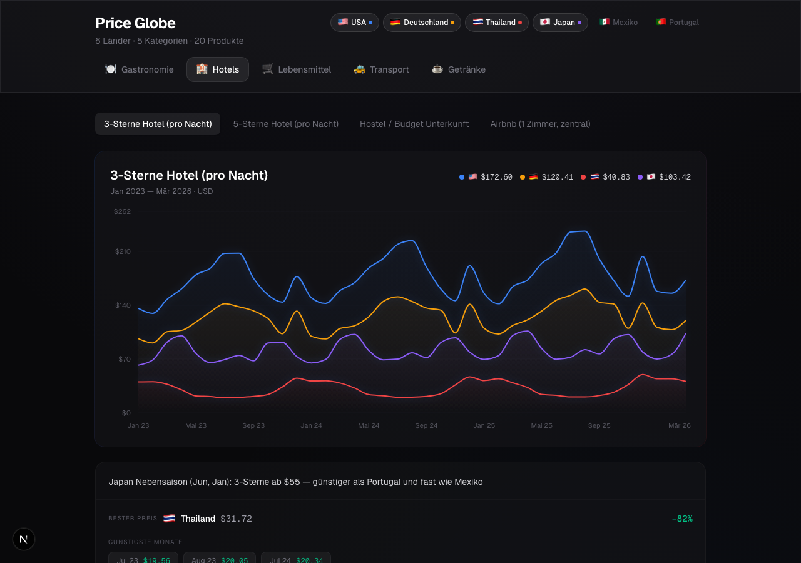
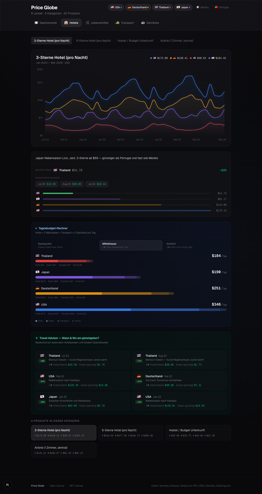

# Price Globe

**International cost-of-living comparison with real data, seasonal patterns, and travel insights.**

Compare prices for hotels, restaurants, groceries, transport, and drinks across 6 countries. Find the cheapest months to travel, spot pricing anomalies, and make data-driven decisions.

<p align="center">
  
</p>

<p align="center">
  <strong>🇺🇸 USA</strong> · <strong>🇩🇪 Germany</strong> · <strong>🇹🇭 Thailand</strong> · <strong>🇯🇵 Japan</strong> · <strong>🇲🇽 Mexico</strong> · <strong>🇵🇹 Portugal</strong>
</p>

---

## What makes this different

Most price comparison tools show static tables. Price Globe shows **price trends over time** with real seasonal patterns, so you can answer questions like:

- **When are Thailand hotels cheapest?** → Jun-Oct (monsoon), 35-40% below peak
- **Is Japan actually cheap now?** → Yes. Yen crash to 150/USD makes 5★ Tokyo < 3★ NYC
- **Where's the best coffee value?** → Portugal: $2.50 cappuccino, half of Germany, third of USA
- **Cheapest Digital Nomad base?** → CDMX: $35/night Airbnb, $2.50 DiDi, $2.30 tacos

## Features

<details>
<summary>Full page screenshot</summary>

</details>

- **6 Countries** — USA, Germany, Thailand, Japan, Mexico, Portugal
- **5 Categories** — Gastronomy, Hotels, Groceries, Transport, Drinks
- **20 Products** — From McMeals to 5-star hotels, each with 39 months of data
- **Daily Budget Calculator** — What does a day cost? 3 tiers (Backpacker / Mid-range / Comfort) with stacked cost breakdown
- **Travel Advisor** — Automatically surfaces the best deals by country and month
- **Seasonal Patterns** — Real tourism cycles: cherry blossom pricing, monsoon discounts, Christmas market premiums
- **Insights** — Per-product analysis with cheapest months, savings percentages, comparison bars
- **Interactive** — Toggle countries, hover months, click products. Everything is responsive.
- **Mobile-first** — Horizontal scrolling, touch-friendly, optimized for phones
- **Dark mode** — Glass morphism, gradient fills, zero eye strain

## Data Sources

All prices are **real 2024 mid-year averages** from verified sources. Not estimates, not AI-generated numbers.

| Source | What | Coverage |
|--------|------|----------|
| [Numbeo](https://www.numbeo.com/cost-of-living/) | Restaurants, groceries, transport | All 6 countries |
| [Hotels.com HPI 2025](https://www.expedia.com/newsroom/hotels-com-2025-hotel-price-index/) | Hotel price index by star rating | USA, global benchmarks |
| [Statista](https://www.statista.com/) | Hotel rates, market data | Germany, EU |
| [USDA ERS](https://www.ers.usda.gov/data-products/food-price-outlook/) | Food price outlook, CPI | USA |
| [Destatis](https://www.destatis.de/) | Consumer price index | Germany |
| [ADAC](https://www.adac.de/verkehr/tanken-kraftstoff-antrieb/) | Fuel prices | Germany |
| [Booking.com](https://www.booking.com/) / [Agoda](https://www.agoda.com/) | Hotel averages | Thailand, Japan, Mexico, Portugal |
| [FRED](https://fred.stlouisfed.org/) | Egg prices, CPI components | USA |

### Seasonal patterns

Hotel seasonality is modeled with 12 monthly multipliers based on real tourism data:

| Country | Peak Season | Low Season | Swing |
|---------|------------|-----------|-------|
| 🇹🇭 Thailand | Nov-Feb (dry, cool) | Jun-Oct (monsoon) | 35-50% |
| 🇯🇵 Japan | Mar-Apr (sakura), Oct-Nov (koyo) | Jun, Jan | 30-45% |
| 🇲🇽 Mexico | Dec-Apr (dry) | Jun-Oct (rain) | 25-40% |
| 🇵🇹 Portugal | Jul-Aug (summer) | Nov-Feb (winter) | 30-50% |
| 🇩🇪 Germany | Jun-Sep + Dec (Xmas) | Jan-Mar | 20-35% |
| 🇺🇸 USA | Jun-Aug + Dec (holidays) | Nov, Jan-Feb | 15-25% |

## Tech Stack

| Layer | Technology |
|-------|-----------|
| Framework | Next.js 16, React 19 |
| Language | TypeScript (strict) |
| Charts | Recharts (ComposedChart, Area + Line) |
| Styling | Tailwind CSS v4 |
| Data | Seeded PRNG for reproducible time series |
| Fonts | Geist Sans + Geist Mono |

## Quick Start

```bash
git clone https://github.com/yourusername/price-globe.git
cd price-globe
npm install
npm run dev
```

Open [http://localhost:3000](http://localhost:3000).

## Architecture

```
src/
├── app/
│   ├── layout.tsx          # Root layout, fonts, metadata
│   ├── page.tsx            # Main page with state management
│   └── globals.css         # Tailwind + custom styles (glass, mesh, glow)
├── components/
│   ├── PriceChart.tsx      # Recharts ComposedChart with area fills
│   ├── InsightCard.tsx     # Price analysis, cheapest months, bars
│   ├── DailyBudget.tsx     # Budget calculator (3 tiers, stacked bars)
│   ├── TravelAdvisor.tsx   # Smart deal recommendations
│   ├── CategoryNav.tsx     # Category tabs
│   ├── CountryToggle.tsx   # Country filter pills
│   └── ProductSelector.tsx # Product tabs per category
└── data/
    └── prices.ts           # All data, types, generation, helpers
```

### Adding a new country

1. Add to the `Country` type union
2. Add a `CountryInfo` entry to the `countries` array
3. Add seasonal patterns to `S` (12 monthly multipliers)
4. Add `{ base, inflation, season }` to each product's `prices` config

### Connecting live data

The architecture supports API integration. Potential sources:
- Numbeo API ($100/year) for real-time cost of living
- World Bank Open Data for macro indicators
- OECD PPP data for purchasing power parity
- Custom scraping via Playwright for hotel aggregators

## Contributing

Contributions welcome. Ideas for high-impact additions:

- [ ] More countries (South Korea, Colombia, Indonesia, Morocco)
- [ ] Currency converter toggle (show in local currency)
- [ ] "Cost of a day" calculator (hotel + 3 meals + transport)
- [ ] Historical data integration via Numbeo API
- [ ] Share/embed specific comparisons
- [ ] PWA support for offline access

## License

MIT — see [LICENSE](LICENSE).
